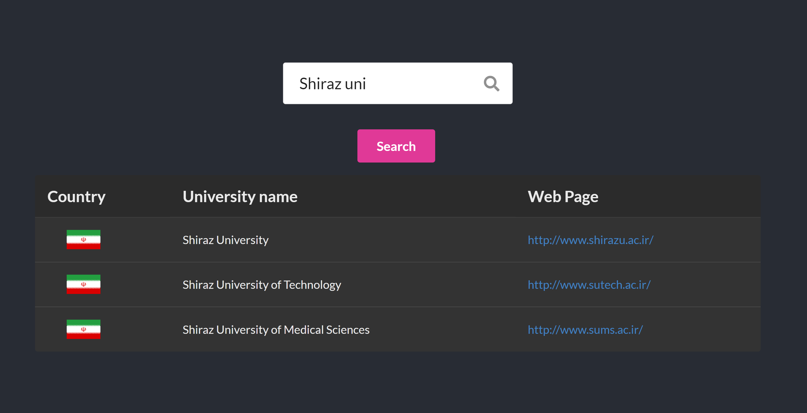

## Find Web Page of Universities

A sample app that helps you to find the official webpage of universities in the shortest time.

<p align="center">
  
</p>

## Demo

See a live demo [here](https://uni-finder.vercel.app).

## How to use

To start developing the application, run with [npm](https://docs.npmjs.com/cli/init) or [Yarn](https://yarnpkg.com/lang/en/docs/cli/create/).

```bash
npm i
npm run dev
# or
yarn add
yarn dev
```

This starts the development server on http://localhost:3000.

Visit http://localhost:3000 to view the application.

## Tech Stack


